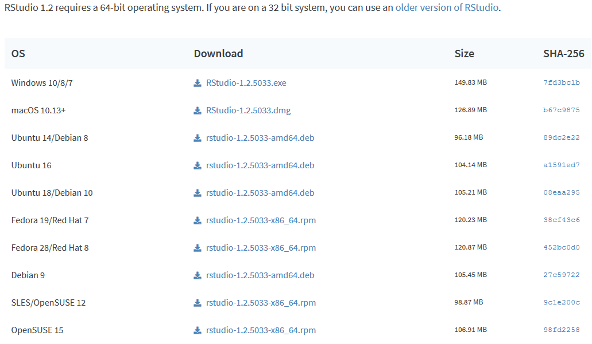

```{r setup, include=FALSE}
knitr::opts_chunk$set(echo = FALSE)
options("scipen" = 10)


```


# Statistical analysis softwares


## SAS, SPAD, SPSS... and R


<br>

<p class="smallpcenter">**In the early 2000s, a new software** emerged and **progressively established itself as an equal to the three major softwares** that corner the market in statistical analysis</p> 


<p class="R"></p>


<p class="moyp">**We would anticipate users of these softwares may be interested in R** </p>


## Proprietary softwares are 

### not free (of charge)


</p>
<p class="xsmallp" align="center">SPSS license *Base edition*</p>

<aside class="notes">
Chers : expensive
souscritpion (attention coquille !) par mois/année : monthly/yearly subscription
</aside>


## Not cross-platform

<br>


```{r }

Software <- c("SAS","SPAD","SPSS","Stata")
Windows <- c("yes","yes","yes","yes")
macOS <- c("terminated","no","yes","yes")
Linux <- c("yes","no","no","yes")
BSD <- c("no","no","no","no")
Otros_Unix <- c("yes","no","no","no")

tab <- data.frame(Software, Windows, macOS, Linux, BSD, Otros_Unix)

colnames(tab) <- c(" Software/System"," Windows", " MacOS", " Linux", " BSD", " other Unix")

knitr::kable(tab)
```

<br>

<p class="xsmallp" align="center">https://en.wikipedia.org/wiki/Comparison_of_statistical_packages</p>

## Specialized


<aside class="notes">
and rarely offer functions beyond statistical analysis
</aside>

<br>

<ul class="pucsmall">
> - **SPSS**: oriented towards social science
> - **SPAD**: oriented towards decision making
> - **Stata**: recommended for economists and epidemiologists
> - **SAS**: broad-based with some restrictions (i.e. graphic design)

</ul>

<br>

<p class="moyp">They provide **zero or few network analysis**, **sequence data analysis**, **lexicometry** (except for SPAD), and few features dedicated to valorisation.</p> 


## Restricted

<p class="moyp3">**Centralized management limits** the following:</p>


<ul class="pucsmall" style="padding:40px;">      
> - **sustainability**
> - **freedom of use**
> - **compatibility** with other softwares (data format)
> - compatibility of version **updates**  
> - **development** of new functions
> - available **languages** (software and documentation)
> - available **sources of information**

</ul>

## Difficulties with...

<br>

<ul class="pucsmall">
> - **training**
> - **usage**
> - **teamwork**
> - **interdisciplinary work**
> - **reproducibility**

</ul>

<br>

<p class="normp">That is why we use R</p>

<aside class="notes">
Permet de réalisé (ATTENTION faute : réaliser) un flux de travail complet en un script, un logiciel.

</aside>

# {data-background="figure/RvsPython.png" data-background-size="1000px"}


##  Close enemies

<br>

<p class="moyp">**Two languages** often used in data management and data analysis<br>
**and compared against each other because of their similar features**...</p>


<p align="center""></p>

<p class="normp">Choosing **R** or **Python** depends on    
**who I am** and **what I want to do**</p>

##  Two divergent communities

<div id="left" style="padding: 20px 0px 0px 20px;">
<p align="center" style="padding-top:0px 0px 0px 0px;margin-top:0px;"></p>

<p align="center" style="padding-top:0px 0px 0px 0px;margin-top:0px;"></p>

<ul class="xpucsmall" style="margin-top:30px;">
> - **accessible** and **inclusive** community
> - rich and **structured documentation**
> - discipline: **data analysis**
> - jobs: **research and development**


</ul>

</div>

<div id="right">
<p align="center" style="margin-top:0px;padding-top:0px;"></p>


<p align="center" style="padding-top:0px 0px 0px 0px;margin-top:0px;"></p>

<ul class="xpucsmall" style="margin-top:0px;">
> - community of **specialists** 
>-  **more users**
> - discipline: **data science**
> - jobs: **computer engineer**, **programmer**...


</ul>
</div>

<br>


##  Specific features
     

<div id="left">

<p class="moyp" align="center" style="padding-top:0px;margin-top:0px;">**R** is as brilliant...<p>
<p align="center" style="padding-top:0px;margin-top:30px;"></p>


<ul class="xpucsmall" style="margin-top:20px;">
> - **easier to pick up** (Rstudio)
> - **statistical analysis**
> - **graphic design**
> - **valorisation** (markdown, application...)

</ul>


<p class="smallpcenter3">For **users less advanced** in programming<br>
specialized in **data analysis**<p>


</div>


<div id="right">

<p class="moyp" align="center" style="padding-top:0px;margin-top:0px;">...as **Python** is powerful!<p>
<p  style="align:center;margin-top:0px 0px 0px 0px;padding-top:0px 0px 0px 0px;"></p>


<ul class="xpucsmall" style="margin-top:20px;">
> - more **powerful** and non specialized
> - **big data** management
> - **web scraping** and **NLP**
> - **software development/programming**

</ul>


<p class="smallpcenter3">For **experts** in programming<br>
specialized in **data science**<p>


</div>


#  {data-background="figure/R.png" data-background-size="450px"}

## History of R

<br>

<aside class="notes">
Au départ, les chercheurs cherchaient des idées pour construire le meilleur environnement statistique
</aside>

<p class="smallpcenter">**R is based on programming language S**, created in 1988</p> 

<ul class="xpucsmall">
> - **1992**: **R. Gentleman** and **R. Ihaka begin working on the development** (research project)
> - 1993: publication of the **first binary version** of R on Statlib
> - **1995**: **R is an open source software** under the terms of the **GPL2 license**
> - 1997: Creation of the *R core group*. Creation of the CRAN (K. Jornik and F. Leisch)
> - 1999: Creation of the R website (*r-project.org*) . First in person meeting of the *R core team* 
> - **2000**: **R 1.0.0** is released. John Chambers (designer of the S language), joins the *R Core team* 
> - 2001: Creation of *R News* (known today as the *R Journal*)
> - **2003**: **Creation of the** ***R Foundation***
> - 2004: First *UseR!* conference (Vienna)
> - **2004**: **R 2.0.0** is released
> - 2009: First edition of the *R Journal*
> - **2013**: **R 3.0.0** is released
> - **2015**: **Creation of the** ***R Consortium*** (involving the *R Foundation*)
> - **2020**: **R 4.0.0** is released

</ul>
<br>
<p class="xsmallp" align="center">*https://blog.revolutionanalytics.com/2017/10/updated-history-of-r.html*</p>

## significant support

<br>

<p class="normp">The result of **30 years of research and development**</p>

<br>

Major financiers  **support** the development of **R**: ***Microsoft***, ***Google***, ***Oracle***, ***Esri***... 

<br>

<p class="moyp">https://www.r-consortium.org/members</p>


## Free and cross-platform

<aside class="notes">
Is part of the free software movement (initiated by Richard Stallman in 1985), a political and social movement aiming to distribute softwares with no commercial secrets (secrecy ? confidentiality?) and open source codes

it runs on a wide variety of UNIX platforms, Windows and MacOS
</aside>


<br>

<ul class="pucsmall">

> - **R is a free and open source software and programming language** 

<br>

> - one of the **GNU GPLv3 packages**


<br>

> - **cross-platform**


</ul>

<br>


```{r}

Software <- c("R")
Windows <- c("yes")
macOS <- c("yes")
Linux <- c("yes")
BSD <- c("yes")
Other_Unix <- c("yes")

tab <- data.frame(Software, Windows, macOS, Linux, BSD, Other_Unix)
colnames(tab) <- c(" Software/System"," Windows", " MacOS", " Linux", " BSD", " Other Unix")

knitr::kable( tab)
```


## Unlimited development

<br>

```{r warning=FALSE, message=FALSE, eval=TRUE, include= TRUE, echo=FALSE}

library('rvest')
url <- "https://cran.r-project.org/web/packages/available_packages_by_date.html"
#Reading the HTML code from the website
webpage <- read_html(url)
td <- webpage %>%  html_nodes("td")
rank_data <- html_text(td)

vec <- c(NULL)
for (t in seq(1,length(rank_data),3))  {
vec <-  c(vec, rank_data[t])
}

library(stringr)
vec <- str_trim(vec)
test <- as.data.frame(vec)
test$nb <- 1
test$date <- as.Date(test$vec)
test <- test[,c(3:2)]

library(plyr)
test2 <-  ddply(test, .(date), summarize, nb=sum(nb))
test2$cum <- cumsum(test2$nb)
test <- test2[,c(1:3)]

nb_function_base <- length(lsf.str("package:base"))

# Nombre de fonctions primitives
base <- length(lsf.str("package:base")) 
stats <- length(lsf.str("package:stats")) 
utils <- length(lsf.str("package:utils")) 
methods <- length(lsf.str("package:methods")) 
grDevices <- length(lsf.str("package:grDevices")) 
graphics <- length(lsf.str("package:graphics")) 
datasets <- length(lsf.str("package:datasets")) 

Nb_prim <- base + utils + stats + methods + grDevices + graphics + datasets 

```


<aside class="notes">

Fonctions primites contenues en 7 librairies (base, estadísticas, gráficos...) qui sont chargées automatiquement.

</aside>


<p class="smallpcenter">**R offers `r Nb_prim` standard** statistical analysis and graphics **functions** (core-based)</p>

<p class="smallpcenter">Many packages are available to enrich this core base, they are listed on the      
[***Comprehensive R Archive Network***](https://cran.r-project.org/web/packages/available_packages_by_name.html) (**CRAN**). Ex : </p>

<ul class="xpucsmall">
> - ***quanteda*** - **textual analysis**
> - ***igraph*** - **network analysis**
> - ***sf*** - **spatial vector data handling**
> - ***shiny*** - **interactive web applications**
> - ...
</ul>

<br>


<p class="moyp">**R has a modular structure that offers a multitude of applications**<br>
**Its development is only limited by contributions**</p>


## Unlimited development

<br>

```{r warning=FALSE, message=FALSE, eval=TRUE, include= TRUE, echo=FALSE, fig.width = 10, fig.height=  4.8}


library(ggplot2) 

p <- ggplot(test2) + 
geom_line(aes(date, cum), lwd = 1, col = '#6c9aba') + 
xlab("") + 
ylab("") + 
scale_x_date( date_minor_breaks = "1 month", date_labels = "%Y", breaks = as.Date( c('2005-01-01', 
                                                                                     '2006-01-01', 
                                                                                     '2007-01-01', 
                                                                                     '2008-01-01', 
                                                                                     '2009-01-01', 
                                                                                     '2010-01-01', 
                                                                                     '2011-01-01',
                                                                                     '2012-01-01',
                                                                                     '2013-01-01', 
                                                                                     '2014-01-01', 
                                                                                     '2015-01-01', 
                                                                                     '2016-01-01', 
                                                                                     '2017-01-01', 
                                                                                     '2018-01-01', 
                                                                                     '2019-01-01', 
                                                                                     '2020-01-01', 
                                                                                     '2021-01-01'))) + 
annotate(geom = "text", x = as.Date('2018-08-23'), y = 15000, label = paste0( max(test2$cum), ' packages \n (', format(Sys.time(), '%d %b %Y'), ")"), color ="#ff5151", size = 5.5) + 
geom_point(aes(x = max(date), y = max(cum)), color = "#ff5151", size = 3) + 
theme(axis.text = element_text(size = 12, colour ="grey90"), 
      panel.background = element_rect(fill = "transparent"), 
      plot.background = element_rect(fill = "transparent", color = NA), 
      panel.grid.major = element_line(colour = "grey40"), 
      panel.grid.minor = element_line(colour = "grey25"), 
      legend.background = element_rect(fill = "transparent"), 
      legend.box.background = element_rect(fill = "transparent")) 

ggsave(p, filename = "figure/graph.png", bg = "transparent", dpi = 300) 


```


<p class="smallpcenter">Number of available packages on the [CRAN](https://cran.r-project.org/)</p>

</p>


## Versatile

<br>
<br>

<aside class="notes">
Croissance utilisateur = croissance de la polyvalence de l'outil

Toutes les fonctionnalités pour toutes les étapes de la chaîne de traitement

</aside>

<p class="moyp">**Available packages allow a huge range of operations**. From data collection to the final results' valorisation (chart, gaphic design, document, website...)</p> 

<br>


<p class="nrmp">**its versatility** makes R a **complement** and even a **competition** to many **existing softwares**</p>


## Versatile

<br>

<p align="center"></p>


## A worldwide based community of users
 
<p align="center"></p>

<p class="xsmallp">https://benubah.github.io/r-community-explorer/rugs.html</p>


## ...and companies

<p align="center"></p>

<p class="xsmallp">https://data-flair.training/blogs/r-careers/</p>


## Reliable


<br>

<ul class="pucsmall">
> - **financial support from investors** (*R Consortium*)
> - **an involved community**
> - an open source software that is **open and therefore verifiable**
> - some glitches encountered, however...

</ul>

<aside class="notes">

Réputation des développeurs !

</aside>


<br>       
<p class="moyp">**The information quickly runs through open software communities**</p>


## reproducible work

<br>  

<ul class="pucsmall">

> - **a unique software** to work on **every processing step**
> - contents are **easily filed and shared** (code scripts) 
> - it only takes **a computer to replicate the work**


</ul>

<br>

<p class="moyp">**Reproducibility** means **sharing** and **transparency**!</p>


## Inconveniences


<br>


<ul >
> - **R is a programming language first**


<br>

> - **Documentation & resources are mainly in English**


<br>

> - **A very basic interface**


</ul>


#  {data-background="figure/Rstudio_logo.png" data-background-size="700px"}


## What is RStudio?

<br>

<p class="smallpcenter">RStudio is a company developing and releasing softwares and services based on R.<br>
**It is the major private actor in R community**</p>  


<p class="smallpcenter">**RStudio (its employees) developed several reference packages**. *Ex :*</p>

<ul class="xpucsmall">
> - **rmarkdown** (*document production*)
> - **shiny** & **flexdashboard** (*web application* & *dashboard*)
> - **ggplot2** (*graphic design*)
> - **dplyr** & **tidyr** (*chart handling*)
> - **stringr** (*character string handling*)
> - ...

</ul>

<br>
      
<p class="smallpcenter">**Rstudio** also released **an integrated development environment** (**IDE**), <br>**making R easier to work with**</p>


## Basic R interface

<div id="left">

<p align="center"></p>


<p class="legend" align="center">*R interface on Windows*</p>


</div>

<div id="right">

<p align="center"></p>


<p class="legend" align="center">*no interface on Linux (terminal)*</p>

<br>

<p class="smallpcenter">**The RStudio IDE makes it easier to learn and use R **</p>

</div>

## IDE Rstudio

<p align="center"></p>

## IDE Rstudio

<p align="center"></p>

## Other strengths

<br>

<ul class="pucsmall">
> - **project file organization**
> - **clicking functions**
> - **predictive text**
> - **keyboard shortcuts**

</ul>

<br>

<p class="nrmp">it is **simple**, **complete** and constantly **evolving**...</p>

**Use the RStudio environment!**


# Installation

## Install R

<br>

 
<p class="moyp">**Installing** R and the Rstudio IDE **is as smooth as any other software**. Download R through the [CRAN](https://cran.r-project.org/)</p>

<br>

<p align="center"></p>

<p class="moyp">https://cran.r-project.org/</p>


## Install the Rstudio IDE

      

<p class="moyp2">Download the **Desktop version** from [Rstudio website](https://rstudio.com/)</p>

<p align="center"></p>

<p class="moyp">https://rstudio.com/products/rstudio/download/</p>


## And we're off!


<p align="center"></p>

**Launch RStudio** (not R) to begin


# {data-background="figure/R.png" data-background-size="450px"}


<h3>**Built with...**</h3>

<br>
<br>
<br>
<br>
<br>
<br>
<br>
<br>


<p class="smallpcenter"><b>`r sessionInfo()[1]$R.version$version.string`</b></p>


## Free and open presentation <br> CC BY 3.0 license

<br>


<p class="moyp">consultation:</p>

<ul class="xpucsmall">


> - English version: https://hpecout.gitpages.huma-num.fr/R_presentation_EN/
> - French version: https://hpecout.gitpages.huma-num.fr/R_presentation_FR/
> - Spanish version: https://hpecout.gitpages.huma-num.fr/R_presentation_SP/


</ul>


<br>

<p class="moyp">source code:</p>

<ul class="xpucsmall">


> - Git (english): https://gitlab.huma-num.fr/hpecout/R_presentation_EN
> - Git (french): https://gitlab.huma-num.fr/hpecout/R_presentation_FR
> - Git (spanish): https://gitlab.huma-num.fr/hpecout/R_presentation_SP

</ul>

<br>


## Documentation

<br>

<p class="smallpcenter">Numerous referenced documentary resources (EN, FR and SP) on...</p>


<br><p class="moyp"><a href="http://rzine.fr" target="_blank">rzine.fr</a></p>
 


## Thanks

<br>

<p class="moyp">[Natacha Bohin (Barts Cancer Institute)](mailto:n.bohin@qmul.ac.uk)</p>

<p class="moyp">[Timothée Giraud (CNRS)](https://github.com/rCarto)</p>

<p class="moyp">[Violaine Jurie (Université de Paris)](mailto:violaine.jurie@univ-paris-diderot.fr)</p>

<br>

<div id="left3">
<p align="center"></p>
</div>

<div id="center2">
<p class="smallpcenter">REVEAL.JS</p>
</div>

<div id="center3">
<p class="moyp"></p>
</div>

<div id="right3">
<p align="center"></p>
</div>